# PROP//WASH — FPV UAV Flight Simulator

A single-file FPV drone simulator: real satellite imagery, real elevation data, quaternion rigid-body flight physics, and a 4S LiPo model that sags under load. One HTML file, no build step, no dependencies beyond Three.js from a CDN.

**To fly it:** clone the repo and open `index.html` in a browser. No build step, no install.

```bash
git clone https://github.com/eforus-overseer/propwash.git && open propwash/index.html
```

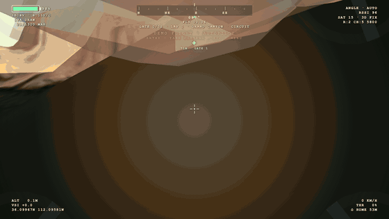

*FPV goggle view over real Grand Canyon elevation data — rotor tips in the frame corners, live OSD, satellite imagery on real DEM relief.*

## Gallery

| | |
|---|---|
| 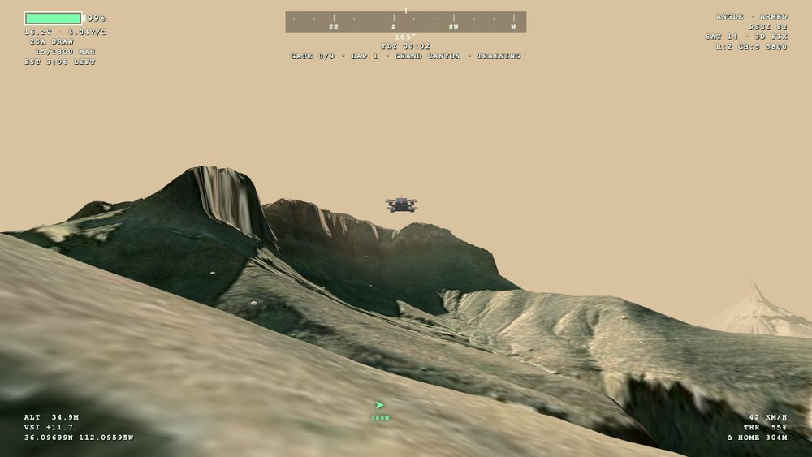 **3rd-person chase** — the modeled 5" quad over Bright Angel | 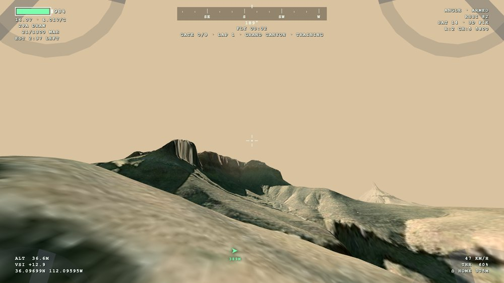 **FPV view** — corner rotor tips, crosshair, full OSD |
| 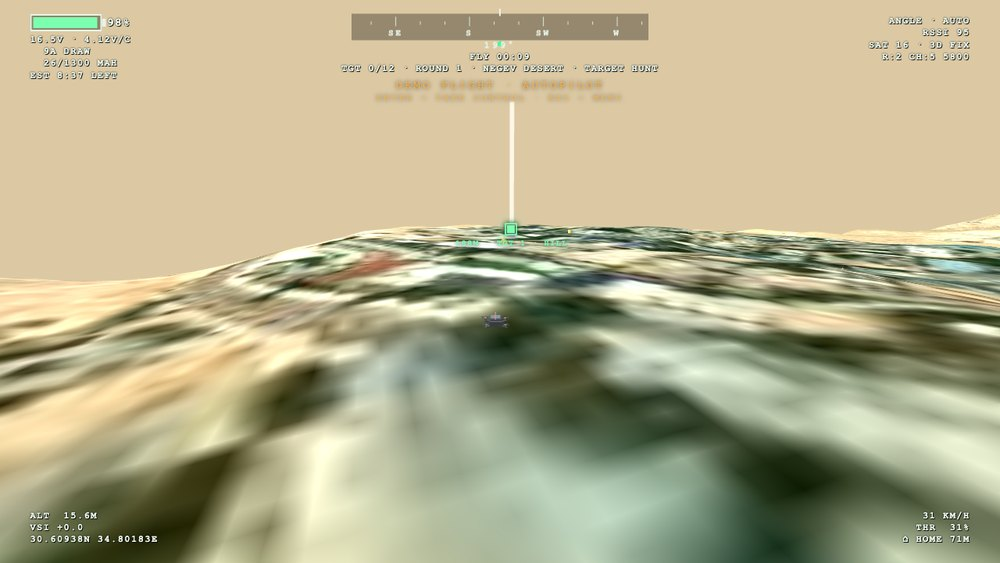 **TARGET HUNT** — beacon beam and distance to the active target | 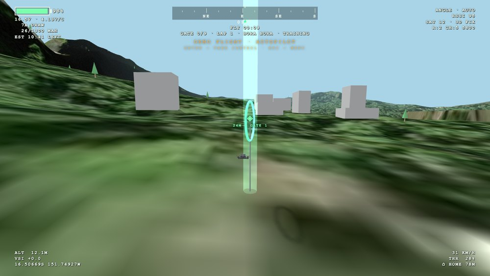 **Race gate** — Bora Bora, gate marker and lagoon |
| 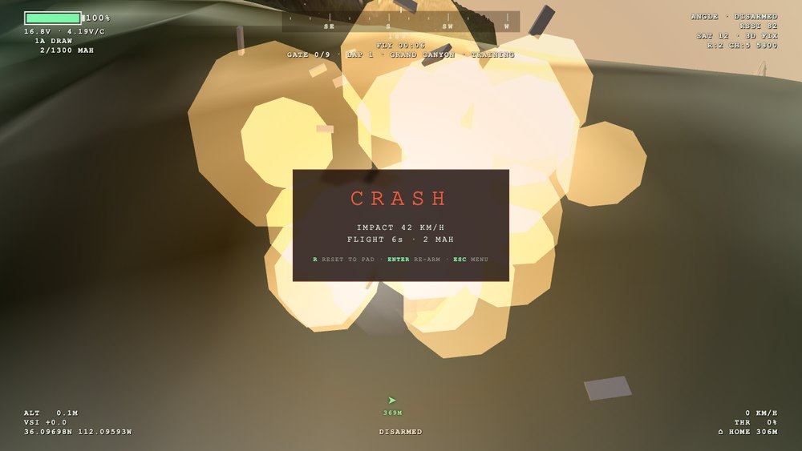 **Crash** — fireball, debris, impact readout | 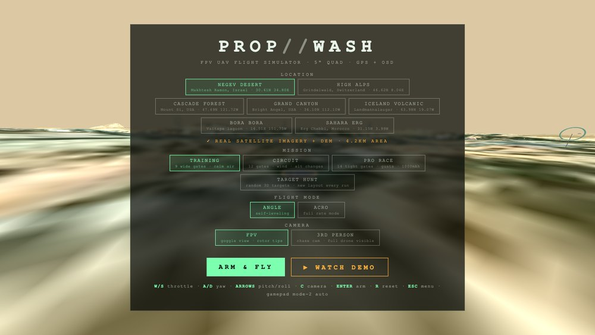 **Menu** — over a live cinematic orbit of the pad |

### Flying the gate course

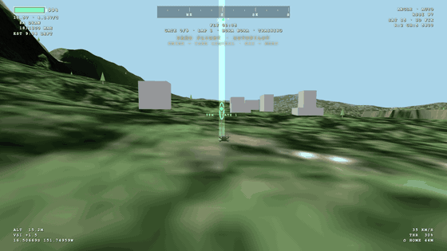

*Bora Bora — chase cam through the gate course, palms and Mt Otemanu behind.*

### Target hunt

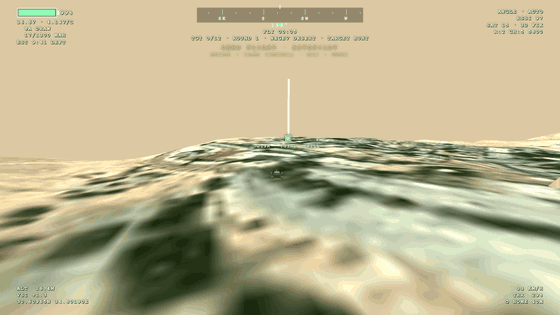

*Negev Desert — hunting randomized targets across real crater-rim terrain.*

### The seven locations

| | | |
|---|---|---|
| 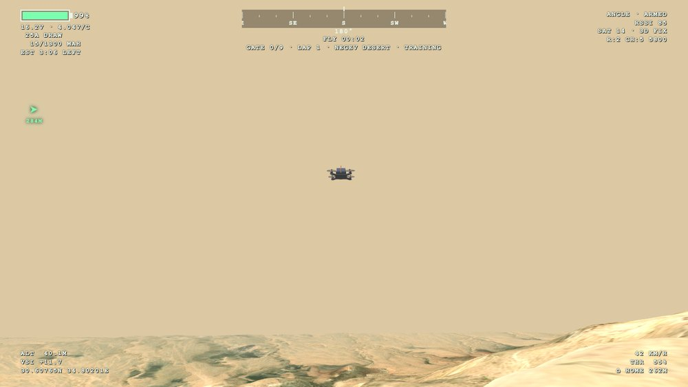 NEGEV DESERT | 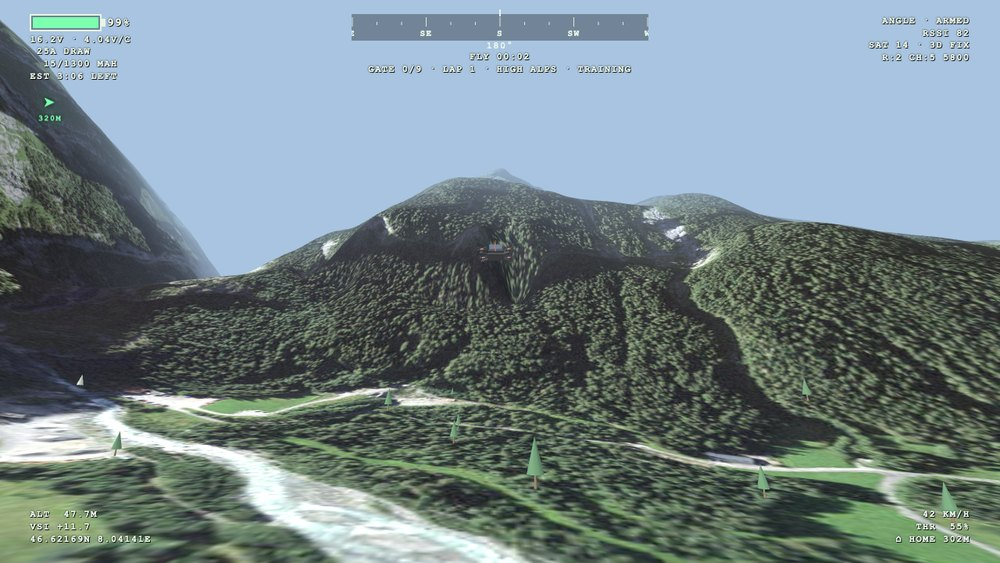 HIGH ALPS | 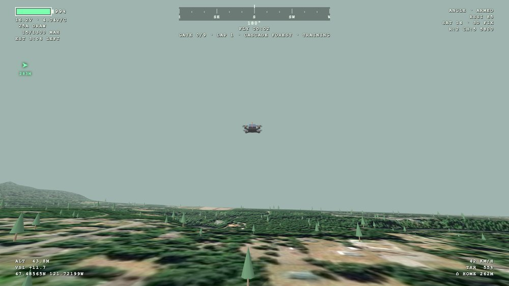 CASCADE FOREST |
|  GRAND CANYON | 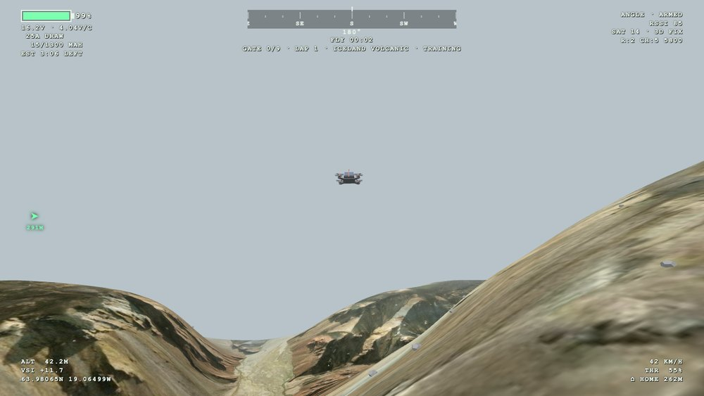 ICELAND VOLCANIC | 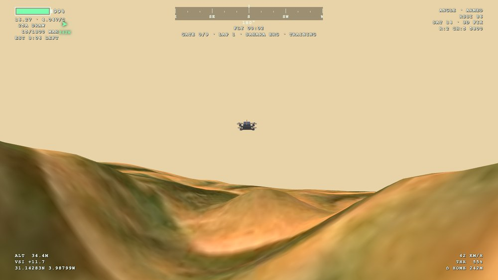 SAHARA ERG |

*All captured in-engine with live Esri satellite imagery and AWS terrarium elevation.*

## Controls

Mode-2 layout. Plug in a gamepad and it switches to real stick input automatically — which is where ACRO mode comes alive.

| Key | Action |
|---|---|
| `W` / `S` | Throttle |
| `A` / `D` | Yaw |
| `↑` `↓` `←` `→` | Pitch / roll |
| `C` | Toggle FPV ↔ 3rd person |
| `ENTER` | Arm (or take control mid-demo) |
| `R` | Reset |
| `ESC` | Menu |

## Locations

Seven real places, each streaming Esri World Imagery tiles for the ground texture and AWS terrarium DEM tiles for the heightfield. Roughly a 3–4 km square of actual earth per location, with a hand-tuned procedural generator as fallback when the network blocks tiles.

| Location | Place | Coordinates |
|---|---|---|
| NEGEV DESERT | Makhtesh Ramon crater rim, Israel | 30.61°N 34.80°E |
| HIGH ALPS | Grindelwald valley, Switzerland | 46.62°N 8.04°E |
| CASCADE FOREST | Mount Si, Washington, USA | 47.49°N 121.72°W |
| GRAND CANYON | Bright Angel, Arizona, USA | 36.10°N 112.10°W |
| ICELAND VOLCANIC | Landmannalaugar, Iceland | 63.98°N 19.07°W |
| BORA BORA | Vaitape lagoon + Mt Otemanu | 16.51°S 151.75°W |
| SAHARA ERG | Erg Chebbi, Morocco | 31.15°N 3.99°W |

Bora Bora is the only location with water: a lagoon plane at true sea level, computed from the DEM offset. Fly below the surface and you splash-crash. Gates ride above the waterline, palms only grow on land, and hunt targets rolling a lagoon spot float as `BUOY` perches.

## Missions

| Mission | Layout | Air |
|---|---|---|
| TRAINING | 9 gates @ 2.6 m radius | Calm (wind 0.35), 1300 mAh |
| CIRCUIT | 12 gates @ 1.9 m | Altitude changes, wind 0.9, 1300 mAh |
| PRO RACE | 14 gates @ 1.5 m | Strong gusts (1.7), only 1000 mAh |
| TARGET HUNT | 12 randomized targets, ~330 m spread | Wind 0.7 |

TARGET HUNT rerolls every arm/reset: targets are random 3D solids (cube, pyramid, cylinder, octahedron, slab) in random sizes and colors, perched on open ground, hilltops, rooftops, or lagoon buoys. The hilltop placer samples 7 candidate spots and picks the highest so hills are genuinely favored. Clear all twelve and your round is scored against your best.

## Simulation

**Flight physics** — thrust as a vector along the quad's body-up axis on a 620 g frame with 24 N max thrust (~4:1 TWR), plus gravity, quadratic drag, and gusting wind. Attitude is integrated on a quaternion with a fixed timestep and substeps per frame. Two modes: **ANGLE** (self-leveling, capped at 38° tilt) and **ACRO** (sticks command body rates directly at 480°/s with expo — flips, rolls, and dives). Disarm mid-air and it dead-sticks down.

**Battery** — a 4S 1300 mAh pack that behaves like one. Voltage sags under current draw (throttle² up to ~80 A), mAh accumulates by coulomb counting, punch fades as the pack dies, and the OSD screams `LAND NOW` below 12.6 V. The gauge shows pack *and* per-cell voltage (`15.4V · 3.85V/C` — what pilots actually watch) plus a live flight-time estimate that shrinks when you punch the throttle.

**Terrain pipeline** — a 2048² texture: a z15 base layer loads first for guaranteed coverage, then 64 z16 tiles overlay at native ~2 m/pixel. Individual tile failures fall back to the base layer underneath rather than breaking. DEM tiles are decoded per-pixel as `h = R·256 + G + B/256 − 32768`. The renderer runs an sRGB output pipeline with neutral lighting in satellite mode, so the photograph's own colors carry the scene instead of being repainted by biome-tinted lights.

**Cameras** — FPV at 100° FOV with 25° uptilt, frame vibration scaled by throttle and prop-wash, and four rotor-tip assemblies intruding at the frame corners the way a real HD cam sees them. Third person sits ~3 m back and 1.2 m up, follows yaw only (no nauseating roll), pulls back up to +1.6 m with speed, never clips terrain, and narrows to 68° FOV.

**Crashes** — ~26 additive fireball particles flashing white-yellow and cooling through orange to ember, 14 billowing smoke puffs, 12 debris pieces on ballistic arcs that bounce with spin damping, a decaying orange point light, a full-screen blast flash, and a synthesized boom (noise burst through a falling lowpass, layered with a 95→28 Hz sub thump).

**Navigation** — sliding compass tape with green (next gate) and orange (home) bearing marks, GPS coordinates projected from each location's true lat/lon, HOME distance, satellite count, and RSSI that degrades with range into a `SIGNAL WEAK — TURN BACK` warning. The active target gets a vertical light beam plus a pulsing on-screen diamond that clamps to the screen edge as a rotating arrow when it leaves your view.

**Demo autopilot** — `▶ WATCH DEMO` flies the course in ANGLE mode using bearing and altitude control loops with the full OSD running. Press `ENTER` to take control wherever it is. It recovers on its own if it clips a tree, and it can fly TARGET HUNT too.

## Architecture

One file, domain-driven modules: `Drone` (rigid body), `FlightCtrl` (stick input → attitude), `Battery`, `World` (terrain heightfield + collision), `Location`, `Mission`, `Race`, `Nav`, `Autopilot`, and `OSD` as a pure read-only projection of state.

Everything downstream reads terrain through a single `World.height()` function, which is why gates hug real slopes, targets spawn on real hilltops, GPS matches the ground under you, and collision runs against the real DEM. Scatter objects are declared in a style table, so each biome states its rock and shrub counts and colors — adding an eighth terrain is a ~15-line config block.

## Stack

- [Three.js r128](https://threejs.org/) (CDN) — rendering
- [Esri World Imagery](https://www.arcgis.com/home/item.html?id=10df2279f9684e4a9f6a7f08febac2a9) — satellite tiles
- [AWS Terrain Tiles](https://registry.opendata.aws/terrain-tiles/) — terrarium DEM elevation
- WebAudio API — synthesized motor whine and crash boom

Tiles stream at runtime, so a network connection is needed for real terrain; without it the sim falls back to procedural generation and the menu says `SATELLITE UNAVAILABLE — PROCEDURAL TERRAIN`.

## Possible next steps

Ideas not yet built:

1. Scale explosion particle count and blast radius with impact velocity — a 120 km/h wall hit deserves more than a 15 km/h tip-over.
2. Blend ~30% of airframe roll into the chase cam for acrobatic drama, versus the current stable yaw-only follow.
3. Add a procedural dune-detail layer on top of the real DEM at Erg Chebbi, since SRTM's 30 m posting smooths small dunes.
4. Animate the Bora Bora lagoon surface instead of leaving it as glass.
5. Nearest-first routing for TARGET HUNT as an alternative to the current generation-order zigzag.
6. Require rooftop targets to be touched from above rather than collected by proximity.
7. Minimap, OSD wind indicator, and a follow-cam replay.
